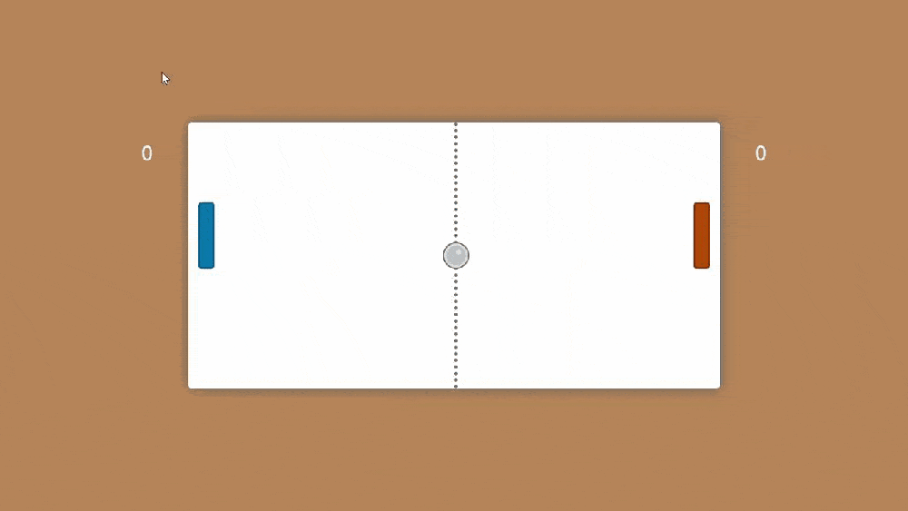

# Ping Pong Project

## A simple ping pong game in JavaScript, with basic scoring system.

 

 

 

It is multiplayer ping pong game where two persons can play this game. You can simply run the file to play the game by downloading all the files that are necessary to the game. 

### Game Start Window

 

   

## Controls

#### For Player A:

	To move paddle up press 'w'
	To move paddle down press 's'

### For Player B:

	To move paddle up press 'UP_ARROW'
	To move paddle down press 'DOWN_ARROW'

### Features
> Play with the computer on multiple rounds

 

### AUTHOR
>  Written by Salamat Sernazarov

 

### Contributing
If you find any bugs, feel free to create an issue or open a PR.
